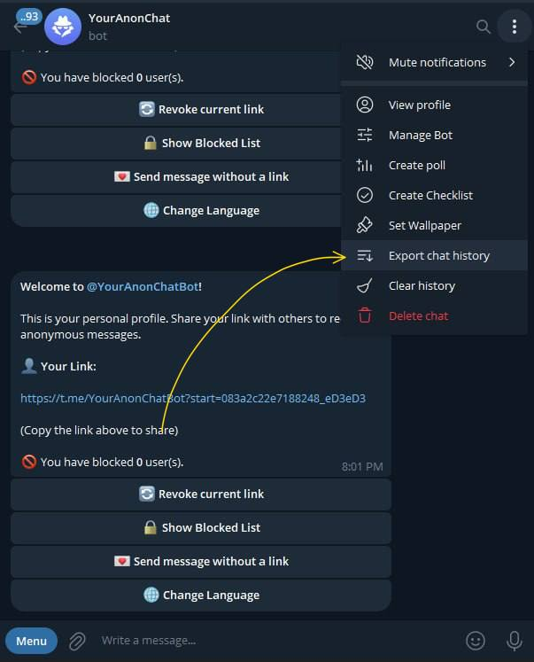
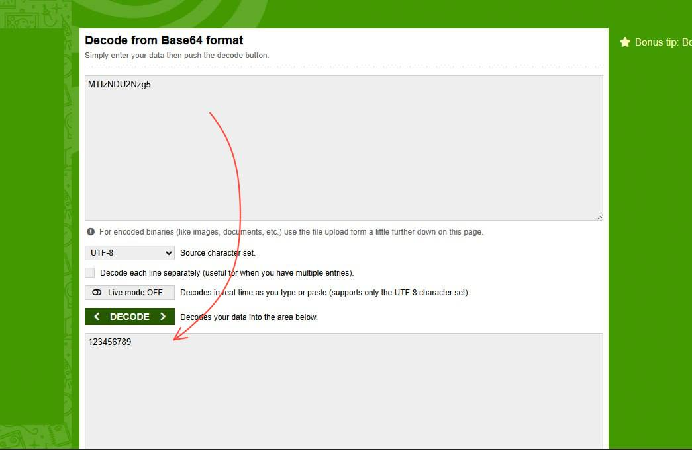

# 🚨 فاجعه امنیتی در ربات‌های ناشناس تلگرام: "ناشناس" یعنی کشک! 🚨

سلام به همه رفقا! 👋

تا حالا شده تو ربات‌های چت ناشناس به یکی پیام بدین و فکر کنین هویت‌تون کاملاً مخفیه؟ 🤔 خب، یه خبر بد براتون دارم: به احتمال ۹۹٪، طرف مقابل می‌تونه با چندتا کلیک ساده بفهمه شما کی هستین! 😱

اینجا می‌خوام پرده از یه گاف امنیتی خیلی بزرگ بردارم که برنامه‌نویس‌های این ربات‌ها دادن و باعث شده یه بازار سیاه راه بیفته که توش هویت شما رو به پول می‌فروشن. 💸

---

## اول بفهمیم داستان چیه: دکمه‌های شیشه‌ای و اون ماجرای `Callback` 🤓

وقتی تو یه ربات ناشناس پیام می‌گیری، زیرش چندتا دکمه خوشگل می‌بینی مثل "پاسخ دادن" یا "بلاک کردن". به اینا میگن **دکمه‌های شیشه‌ای** (Inline Buttons).


حالا وقتی روی یکی از این دکمه‌ها می‌زنی، یه چیزی به اسم **کال‌بک کوئری (Callback Query)** برای ربات فرستاده می‌شه. فکر کن یه نامه محرمانه می‌فرستی به ربات و توش می‌گی: «آهای ربات! من روی دکمه "پاسخ" برای این پیام کلیک کردم». 💌

مهم‌ترین قسمت این نامه، یه تیکه کد به اسم `callback_data` هست که برنامه‌نویس توش یه سری اطلاعات می‌ذاره تا ربات بفهمه باید چیکار کنه.

---

## 💣 گاف بزرگ کجاست؟ پخش کردن آیدی شما!

مشکل دقیقاً همین‌جاست. برنامه‌نویس‌های عزیز (که انگار یکم عجله داشتن 🏃‍♂️)، برای اینکه ربات بفهمه جواب شما رو باید برای کی بفرسته، خیلی راحت میان **چت آیدی (Chat ID)** طرف مقابل رو مستقیم می‌ذارن توی همون `callback_data`.

یعنی دکمه "پاسخ" شما، مثل یه کارت شناسایی عمل می‌کنه که روش آدرس خونه فرستنده پیام نوشته شده! 🏡

```json
// اینجوری گند می‌زنن به امنیت:
{
  "text": "پاسخ بده 📩",
  "callback_data": "reply_123456789" // این عدده همون آیدی طرفه! لو رفتی رفت!
}
```

### چجوری مچ‌شونو می‌گیرن؟ خیلی ساده! 🕵️‍♂️

کافیه با تلگرام دسکتاپ از چت با ربات یه خروجی (Export) بگیری. بعد فایل HTML رو که باز کنی، مثل روز روشنه که آیدی طرف مقابل چنده. به همین راحتی!



بعدش هم با اون آیدی، تو گروه‌ها و کانال‌ها دنبالت می‌گردن و پیدات می‌کنن. یه عده هم از همین راه دارن پول درمیارن و هویت شما رو می‌فروشن. 😟

---

## اونایی که فکر می‌کنن زرنگن: کدگذاری با `Base64` 🤡

یه عده از برنامه‌نویس‌ها گفتن خب بیایم آیدی رو یه جوری بپوشونیم که کسی نبینه! چیکار کردن؟ اومدن با `Base64` کدش کردن.

```json
// مثلاً خیلی امنش کردن الان:
{
  "text": "پاسخ بده 📩",
  "callback_data": "reply_MTIzNDU2Nzg5" // این رشته عجیب غریب همون آیدی قبلیه!
}
```

این کار مثل اینه که روی یه نامه مهم، آدرس رو به زبان مرغی بنویسی! 🐔 هر بچه‌ای هم می‌تونه با یه ابزار آنلاین ساده دیکُدش کنه و به آیدی اصلی برسه. پس اینم امنیت نداره!



---

## ✅ راه‌حل درست و حسابی چیه پس؟

**قانون اول امنیت: اطلاعات حساس کاربر رو هیچوقت نفرست برای خودش!**

راه درستش اینه که ربات همه‌ی اطلاعات رو پیش خودش نگه داره (توی دیتابیس).

۱. **ساخت یه کد رندوم:** وقتی دو نفر می‌خوان چت کنن، ربات باید یه کد کاملاً تصادفی و الکی (مثلاً `a7b2-c8d3-e4f5`) بسازه.
۲. **ذخیره اطلاعات:** بعد این کد الکی رو با آیدی دو طرف توی دیتابیس خودش ذخیره می‌کنه.
۳. **استفاده از کد امن:** حالا توی دکمه "پاسخ"، به جای آیدی طرف، همون کد الکی رو می‌ذاره.

```json
// اینجوری کار درسته:
{
  "text": "پاسخ بده 📩",
  "callback_data": "reply_a7b2-c8d3-e4f5" // این کد هیچ اطلاعاتی از کاربر لو نمی‌ده!
}
```

اینجوری وقتی شما روی دکمه کلیک می‌کنی، ربات کد الکی رو می‌گیره، میره تو دیتابیس خودش نگاه می‌کنه و می‌فهمه باید پیام رو به کی بفرسته. تمام! هویت شما امن باقی می‌مونه. 🛡️


---

## 📢 لیست سیاه ربات‌های ناامن

این ربات‌ها امنیت شما رو جدی نگرفتن. اگه حریم خصوصی‌تون براتون مهمه، دور اینا رو یه خط قرمز بکشین! ❌

**🚨 وضعیت قرمز! (فوق‌العاده خطرناک):**
- `@NashenasBot` *
- `@the404bot` *
- `@BiChatBot` *
- `@BChatBot` *
- `@paym_nashenasBot` *
- `@BChatsBot` *
- `@BitChatsBot` *

**🚫 ربات‌های ناامن دیگه:**
- `@BoldChat_Bot`
- `@ChatOGeramBot`
- `@harfinobot`
- `@HidenChat_bot`
- `@pinkChats_bot`
- `@RazGapBot`
- `@TeIeCommentBot`
- `@XBCHATBOT`

---

## حرف آخر 👋

**کاربر عزیز:** حواست باشه! "ناشناس" بودن تو این ربات‌ها بیشتر شبیه یه شوخیه. با احتیاط ازشون استفاده کن.
**برنامه‌نویس عزیز:** امنیت کاربرات شوخی‌بردار نیست! لطفاً کدهاتو چک کن و این مشکل رو حل کن تا جلوی این سوءاستفاده‌ها گرفته بشه.

مراقب خودتون و اطلاعات‌تون باشید! ❤️
